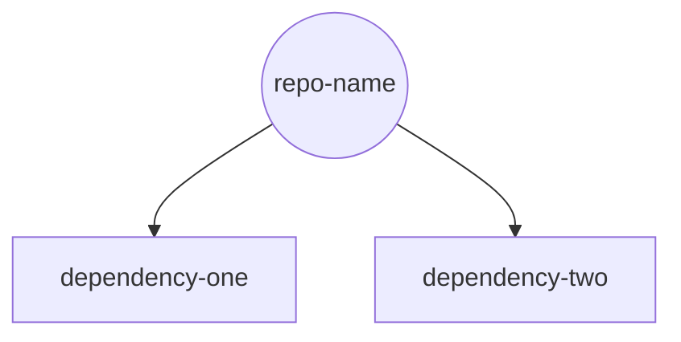

# dependGen - Dependency Chart Generator

## Overview
This script generates a dependency graph and list for a given repository based on its `composer.json` file. The output includes:

1. A Mermaid.js chart visualizing dependencies.
2. A markdown file (`DEPENDENCIES.md`) containing the chart and a detailed list of dependencies.

## Features
- Supports GitHub, GitLab, and Drupal's GitLab instance (`https://git.drupalcode.org`).
- Dynamically detects the default branch for repositories.
- Fetches and processes `composer.json` files recursively for all dependencies.
- Outputs:
  - A Mermaid.js graph.
  - A markdown file with the chart and a human-readable dependency list.

## Requirements
- Python 3.6+
- Internet access to fetch `composer.json` files and repository information.
- The following Python libraries:
  - `requests`

## Installation
1. Clone the repository containing this script.
2. Ensure Python is installed on your system.
3. Install dependencies:
   ```bash
   pip install requests
   ```

## Usage
Run the script with the following command:

```bash
python dependgen.py <repository_url> [branch]
```

### Parameters
- `<repository_url>`: The URL of the repository (GitHub, GitLab, or Drupal's GitLab instance).
- `[branch]` (optional): The branch to use. Defaults to `main` if not specified.

### Example
For a GitHub repository:
```bash
python dependgen.py https://github.com/example-org/example-repo main
```

For a Drupal repository:
```bash
python dependgen.py https://git.drupalcode.org/project/example-repo
```

## Output
The script creates a `DEPENDENCIES.md` file in the current working directory. This file contains:

1. A Mermaid.js chart of dependencies.
2. A detailed list of dependencies with links to their repositories.

### Example Output
#### Dependency Graph


#### Dependency List
### repo-name
- Type: drupal-module
#### Dependencies:
- [dependency-one](https://packagist.org/packages/dependency-one)
- [dependency-two](https://www.drupal.org/project/dependency-two)

## Error Handling
- The script stops execution if a `composer.json` file is not found.
- Invalid or unsupported URLs will result in an error message and script termination.

## Known Limitations
- Assumes that all dependencies either reside on GitHub, GitLab, or Drupal's GitLab instance.
- Does not process repositories without a `composer.json` file.

## Contributing
Feel free to open issues or submit pull requests to improve the script. Contributions are welcome!

## License
This script is available under the GNU General Public License v3.0. See the LICENSE file for details.

